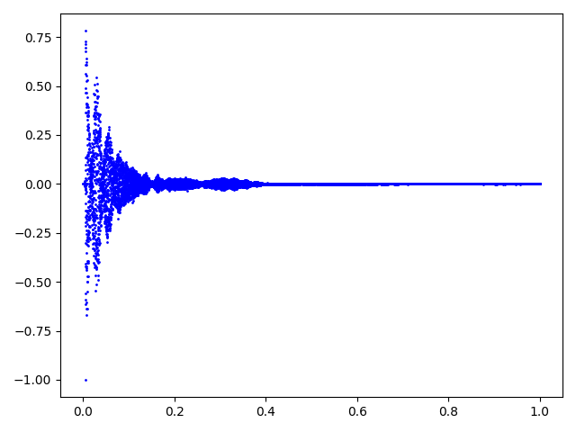

# FID-2-WAV

<div align="center">


[](https://opensource.org/licenses/MIT)

</div>

**Have you ever wanted to _hear_ molecules?** In Organic Chemistry, molecules are often so complex that their allure is hard to decode for the novice eye. So, how can we distill the fingerprint of a complex molecule into something easily understandable? Something that everybody from a kid to a Ph.D. in Chemistry would be able to understand? Music!


Here is a simple tool to convert the Free Induction Decay (FID) signal coming from an Nuclear Magnetic Resonance (NMR) spectrometer to an audible file, so you can hear by yourself what your molecule is trying to tell you.
**FID2WAV** is able to parse FID files produced by Agilent, Bruker or Varian machines! 

## Here are two sound samples of (fairly) similar molecules 

| **(R)-Carvone** | **(-)-Menthol** |
:------------:|:-----------:|
[r-carvone.wav](https://soundcloud.com/user-821418598/r-carvone) | [menthol.wav](https://soundcloud.com/user-821418598/menthol) 
 | 
 | 


## Requirements

The project uses [Python 3](https://www.python.org/downloads/).
To run the project from sources you will need [pip](https://pip.pypa.io/en/stable/installing/) 
and [git](https://git-scm.com/book/en/v2/Getting-Started-Installing-Git).

## Run from source

1) Open a shell window and clone the project.
    ```bash
    $ git clone https://github.com/mstrocchi/fid-to-wav.git
    ```

2) Get into the project's root.
    ```bash
    $ cd fid-to-wav
    ``` 

3) Put the directory containing your FID raw files into `/resources`.

4) Install the required packages.
    ```bash
    $ pip install -r requirements.txt 
    ``` 

5) Run it with Python 3.
    ```bash
    $ python fid-2-wav.py
    ```
   
#### You're all set!

## App usage


1) In the program window, press `Select FID ` to specify the folder containing your FID file.
2) Select the brand of the spectrometer that produced the FID file from the drop-down list.
3) Press `Parse FID` to process the files.
4) Everything is ready! Press `Generate wav` or `Plot` to see the signal.
5) For every new FID you would like to process, repeat these steps.

## Authors

- **Mattia Strocchi** - [m.strocchi@student.tudelft.nl](mailto:m.strocchi@student.tudelft.nl) 
- **Nicolò Tampellini** - [nicolo.tampellini@studio.unibo.it](mailto:nicolo.tampellini@studio.unibo.it) 

## License

**FID2WAV** is available under the MIT license. See the [LICENSE](https://github.com/mstrocchi/fid-to-wav/blob/master/LICENSE.md) file for more info.
